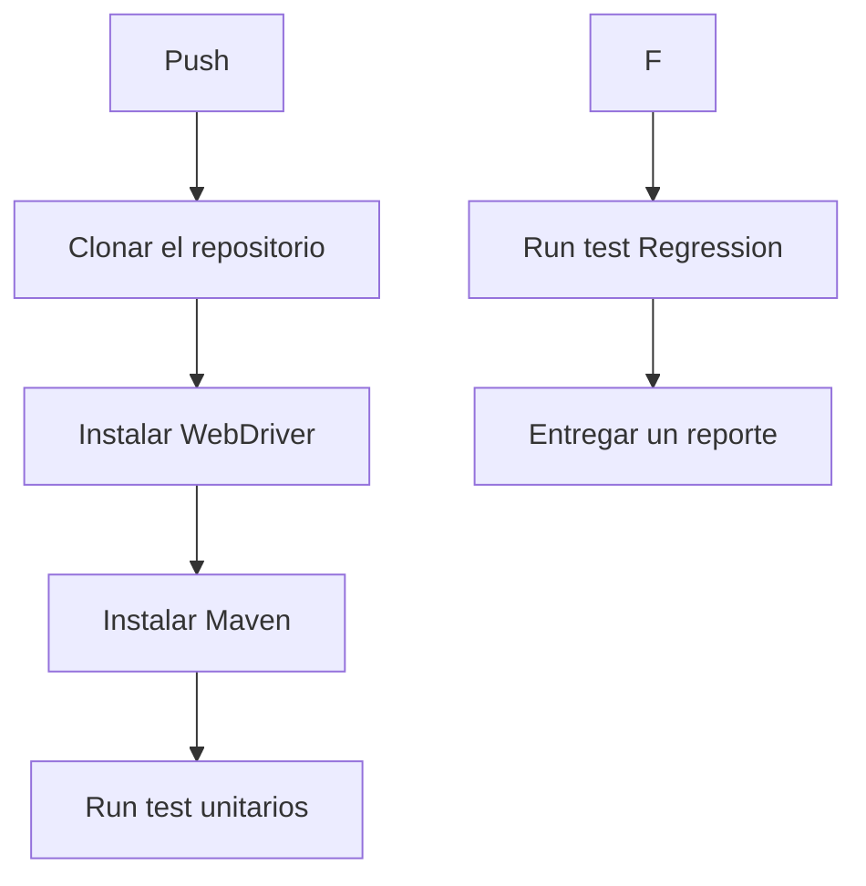

# 🩺 Health Monitoring

Aplicación orientada al backend para registrar el peso de pacientes y visualizar información general. Pensado como parte de una evaluación académica, con enfoque en automatización y pruebas simples.

## 🚧 Estado del proyecto

En desarrollo — documentación y módulos en construcción.

## 🎯 Objetivos

- Aplicar prácticas DevOps como alertas, pruebas automáticas y CI/CD.
- Integrar con APIs externas y herramientas de testing como JMeter.
- Aplicar pruebas de funcionalidades con Selenium
- Aplicar pruebas unitarias y regresión con JUnit

## ⚙️ Tecnologías

- **GitHub Actions** para CI/CD.
- **JMeter / TDD / Selenium** para pruebas.

## 🔧 GitHub Actions

## Authors

- [@renzomedina](https://github.com/RenzoMedina)

